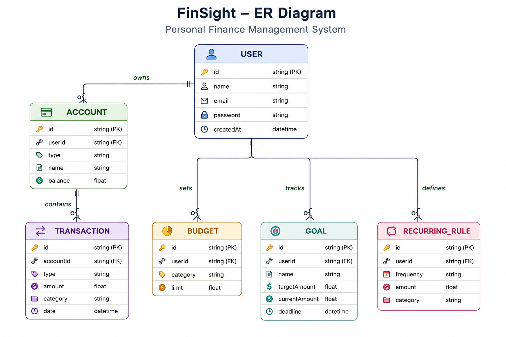
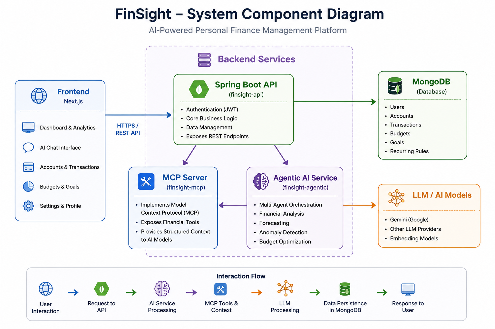
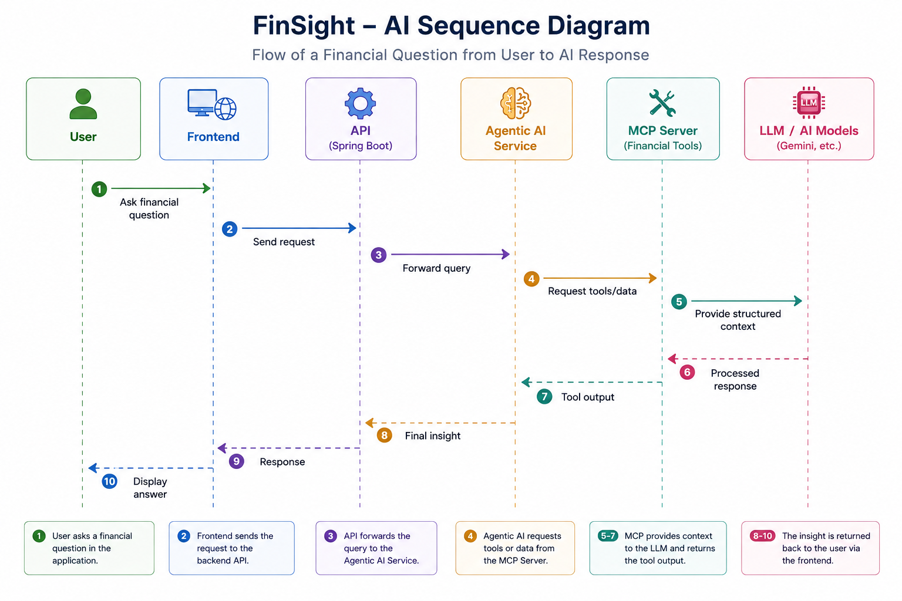
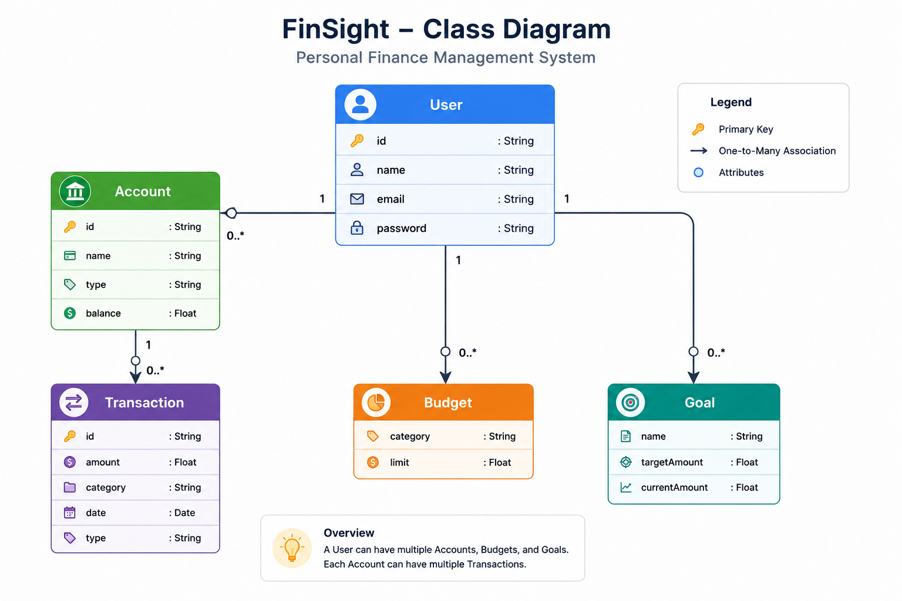

# FinSight - Personal Finance Manager

[](https://nextjs.org/)
[](https://react.dev/)
[](https://tailwindcss.com/)
[](https://jdk.java.net/21/)
[](https://spring.io/projects/spring-boot)
[](https://spring.io/projects/spring-ai)
[](https://www.mongodb.com/)


## 🚀 Overview

**FinSight** is an **AI-powered personal finance management system** designed to go beyond traditional expense tracking by integrating **agentic AI, predictive analytics, and intelligent financial decision support**.

Unlike standard finance apps, FinSight provides:

* **Real-time financial insights**
* **AI-driven recommendations**
* **Multi-agent advisory system**
* **Extensible architecture for LLM tool integration**

---

## 🧠 Core Idea

FinSight combines:

* **Modern full-stack architecture**
* **Microservices-based backend**
* **LLM-powered financial intelligence layer**

This enables users to **interact with their financial data conversationally**, while also receiving **automated analysis, anomaly detection, and forecasting**.

---

## 🏗️ System Architecture

### High-Level Components

```
Frontend (Next.js)
        ↓
REST API (Spring Boot)
        ↓
-------------------------------------
| Core Services (Microservices)    |
|----------------------------------|
| finsight-api      (Core logic)   |
| finsight-mcp      (LLM tools)    |
| finsight-agentic  (AI agents)    |
| finsight-common   (shared libs)  |
-------------------------------------
        ↓
MongoDB (Database)
```

---

## ⚙️ Backend Services

### 🔹 `finsight-api` (Port 4000)

* Core REST API
* Authentication (JWT-based)
* Business logic
* Data persistence

### 🔹 `finsight-mcp` (Port 5100)

* Implements **Model Context Protocol (MCP)**
* Exposes financial tools to LLMs
* Enables structured AI interaction with system data

### 🔹 `finsight-agentic` (Port 5200)

* Multi-agent orchestration layer
* Built using **Spring AI**
* Includes specialized agents:

  * 📊 **Forecaster Agent**
  * 💰 **Budget Optimizer**
  * 🚨 **Anomaly Detector**

### 🔹 `finsight-common`

* Shared DTOs
* Security utilities
* Exception handling
* Domain models

---

## 🎨 Frontend

* **Next.js 14 (App Router)**
* **React 18**
* **Tailwind CSS + shadcn/ui**
* **TanStack Query** for API state management

### Key Responsibilities:

* Dashboard visualization
* User interaction layer
* AI chat interface
* Financial analytics UI

---

## ✨ Features

### 💳 Financial Management

* Multi-account tracking (bank, cash, credit, investments)
* Transaction CRUD operations
* CSV import support

### 📊 Analytics

* Spending insights
* Net worth tracking
* Category-wise visualization

### 🎯 Planning

* Budget management with alerts
* Financial goal tracking
* Recurring transactions

### 🤖 AI Capabilities

* Conversational financial assistant
* Predictive forecasting
* Smart budget optimization
* Anomaly detection in spending

---

## 🧩 Database Design

> MongoDB is used with a document-oriented schema optimized for scalability and flexibility.

### Core Collections:

* `users`
* `accounts`
* `transactions`
* `budgets`
* `goals`
* `recurring_rules`

### Example Relationships:

* A **User** → multiple **Accounts**
* An **Account** → multiple **Transactions**
* A **User** → multiple **Budgets & Goals**

---

### 1. ER Diagram


---

## 📐 UML Diagrams

### 1. System Component Diagram

Shows interaction between frontend, API, MCP server, and agentic services.



### 2. Sequence Diagram (AI Flow)

User → API → Agentic Service → MCP Tools → Response




### 3. Class Diagram

Represents core domain models (User, Transaction, Account, etc.)



---

## 🔐 Authentication & Security

* JWT-based authentication
* Refresh token support
* Secure API endpoints
* Environment-based secrets

---

## 🛠️ Getting Started

### Prerequisites

* Node.js ≥ 18
* Java 21
* Maven
* MongoDB

---

### 🔧 Environment Variables

```env
MONGODB_URI=mongodb://localhost:27017/finsight
JWT_SECRET=your-secure-secret
JWT_REFRESH_SECRET=your-refresh-secret
GOOGLE_AI_API_KEY=your_api_key
```

---

### ▶️ Run Backend Services

```bash
cd backend/finsight-api
mvn spring-boot:run

cd ../finsight-mcp
mvn spring-boot:run

cd ../finsight-agentic
mvn spring-boot:run
```

---

### 🌐 Run Frontend

```bash
cd apps/web
npm install
npm run dev
```

Access: `http://localhost:3000`

---

## 📚 API Documentation

Swagger UI available at:

```
/api/docs
```

---

## 🔮 Future Enhancements

* Bank API integrations (Plaid, etc.)
* Real-time notifications
* Advanced ML-based predictions
* Multi-currency support
* Mobile app

---

## 📌 Why FinSight?

FinSight is not just a finance tracker — it's an **intelligent financial companion** that leverages:

* **AI agents**
* **LLM tool ecosystems (MCP)**
* **Scalable microservices architecture**

to deliver **actionable financial intelligence**.

---

## 📄 Additional Docs

See:

```
BACKEND_README.md
```

for deeper backend architecture details.

---

