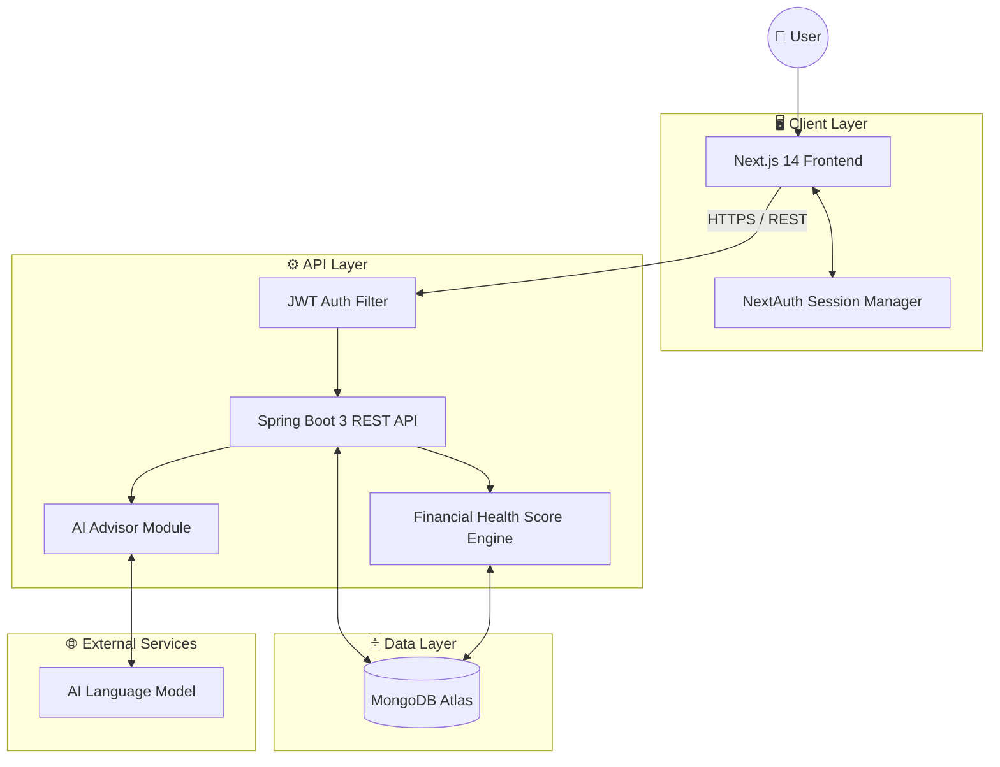
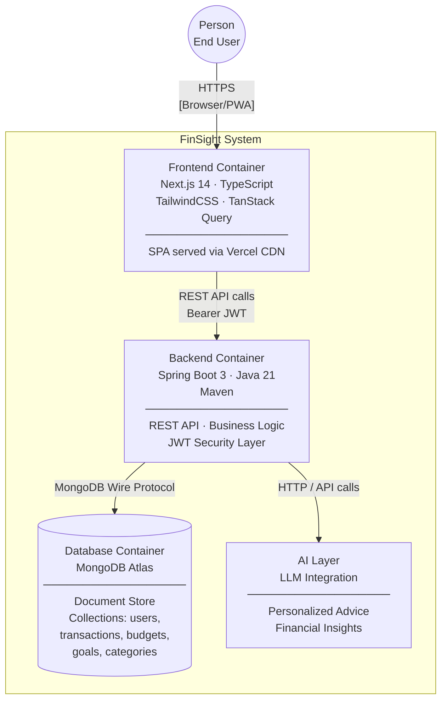
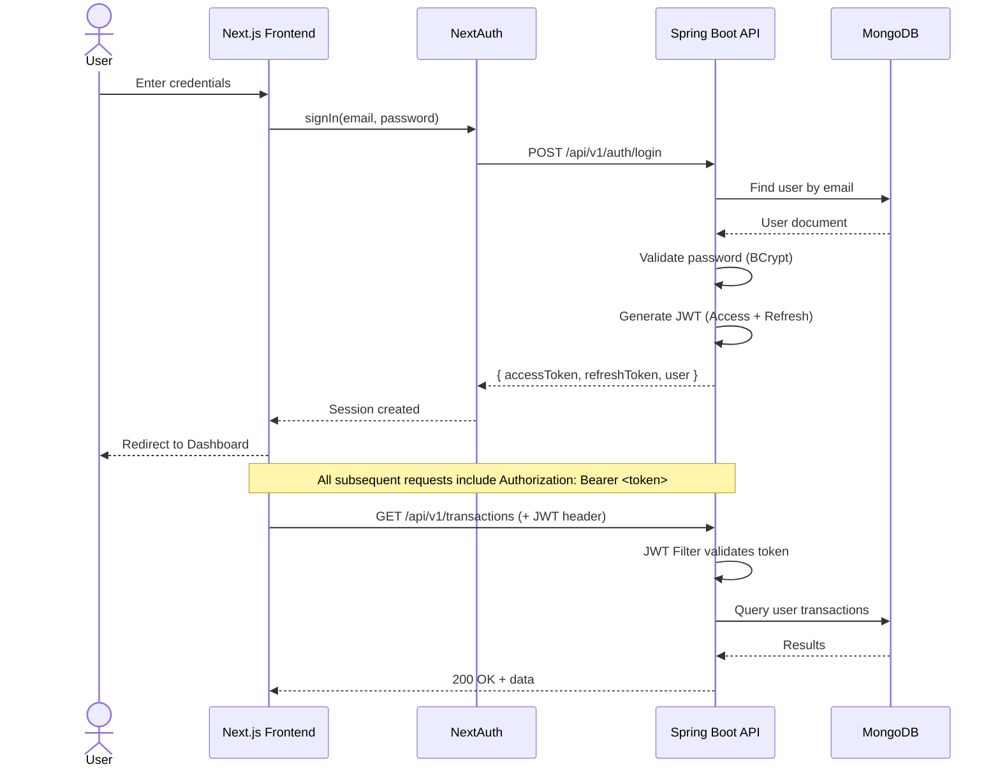
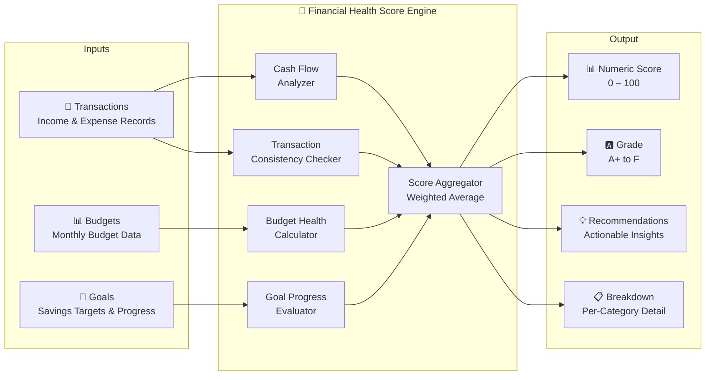
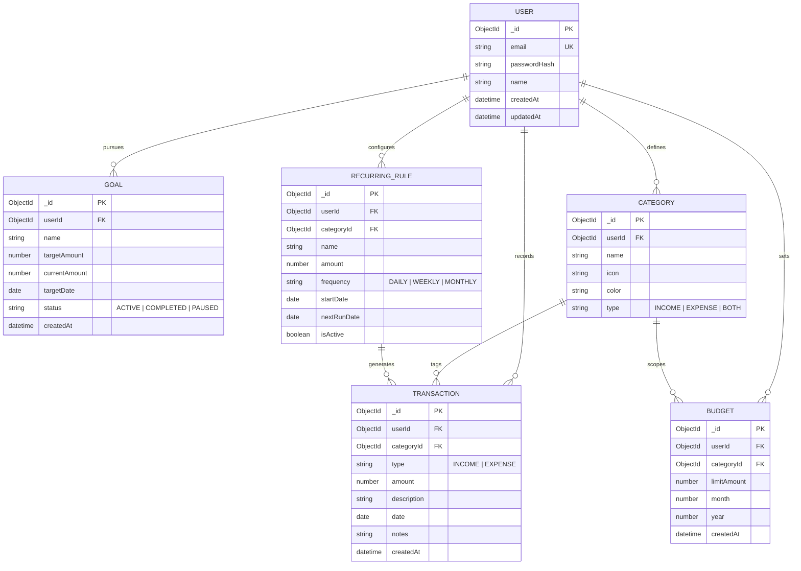
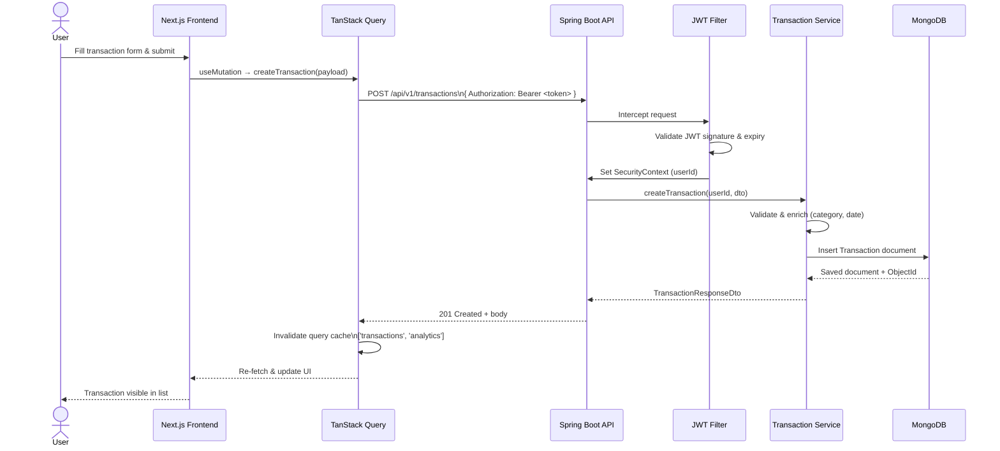
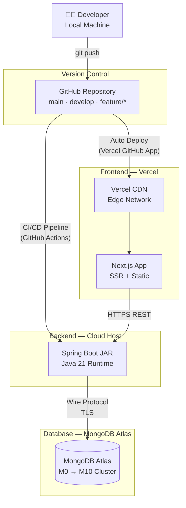
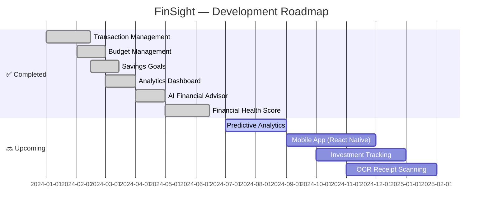

<div align="center">

<br/>

```
███████╗██╗███╗   ██╗███████╗██╗ ██████╗ ██╗  ██╗████████╗
██╔════╝██║████╗  ██║██╔════╝██║██╔════╝ ██║  ██║╚══██╔══╝
█████╗  ██║██╔██╗ ██║███████╗██║██║  ███╗███████║   ██║   
██╔══╝  ██║██║╚██╗██║╚════██║██║██║   ██║██╔══██║   ██║   
██║     ██║██║ ╚████║███████║██║╚██████╔╝██║  ██║   ██║   
╚═╝     ╚═╝╚═╝  ╚═══╝╚══════╝╚═╝ ╚═════╝ ╚═╝  ╚═╝   ╚═╝   
```

# FinSight — AI-Powered Personal Finance Manager

**Take control of your financial future with intelligent insights, real-time analytics, and AI-driven recommendations.**

<br/>

[](https://openjdk.org/)
[](https://spring.io/projects/spring-boot)
[](https://nextjs.org/)
[](https://react.dev/)
[](https://www.typescriptlang.org/)
[](https://www.mongodb.com/)
[](https://jwt.io/)
[](https://vercel.com/)

<br/>

[🚀 **Live Demo**](https://finsight-six-ochre.vercel.app/) · [📖 Docs](#-documentation) · [🛠 Setup](#-local-setup) · [🤝 Contribute](#-contributing)

<br/>

</div>

---

## 📌 Project Overview

Modern personal finance is fragmented — spreadsheets, bank portals, mental math. **FinSight** unifies everything into one intelligent platform.

FinSight gives individuals a full picture of their financial life: track every rupee earned and spent, set and enforce monthly budgets, pursue savings goals with visual progress tracking, and receive AI-generated insights tailored to their actual spending patterns.

The flagship **Financial Health Score** engine synthesizes cash flow, budget adherence, goal progress, and transaction consistency into a single, actionable grade — giving users an honest snapshot of where they stand and a clear path forward.

**Key value propositions:**

- **Unified Dashboard** — income, expenses, budgets, and goals in a single view
- **AI Advisor** — personalized financial recommendations powered by language models
- **Financial Health Score** — a composite wellness metric with grade, breakdown, and action items
- **Secure by Design** — JWT-based authentication with NextAuth session management
- **Production Ready** — deployed on Vercel with a robust Spring Boot backend

---

## ✨ Feature Showcase

| Feature | Description | Status |
|---|---|---|
| 💸 **Transactions** | Track income and expenses with category tagging, search, and advanced filtering | ✅ Live |
| 📊 **Budgets** | Set monthly category budgets, monitor spend rate, receive over-budget alerts | ✅ Live |
| 🎯 **Goals** | Define savings targets with deadlines and visualize progress in real time | ✅ Live |
| 📈 **Analytics** | Spending breakdowns, income vs expense trends, monthly summaries | ✅ Live |
| 🤖 **AI Advisor** | Personalized financial insights and recommendations via AI | ✅ Live |
| 🏥 **Financial Health Score** | Composite score (cash flow + budgets + goals + consistency) with grade & recommendations | ✅ Live |
| 📱 **Mobile App** | Native iOS/Android application | 🔜 Roadmap |
| 🔮 **Predictive Analytics** | ML-based spending forecasting | 🔜 Roadmap |
| 📷 **OCR Receipt Scanning** | Automatic transaction capture from receipts | 🔜 Roadmap |
| 📉 **Investment Tracking** | Portfolio and investment monitoring | 🔜 Roadmap |

---

## 🖼 Screenshots

<details>
<summary><strong>Click to expand screenshots</strong></summary>

<br/>

### 🔐 Login


### 🏠 Dashboard


### 💸 Transactions


### 📊 Budgets


### 🎯 Goals


### 📈 Analytics


### 🤖 AI Advisor


### 🏥 Financial Health Score


</details>

---

## 🏛 System Architecture

The platform follows a clean **three-tier architecture** with a dedicated AI layer and a financial health computation engine.



---

## 📦 C4 Container Diagram



---

## 🔐 Authentication Flow



---

## 🏥 Financial Health Score Architecture



**Scoring Weights:**

| Component | Weight | Description |
|---|---|---|
| Cash Flow | 35% | Income-to-expense ratio over rolling 30 days |
| Budget Health | 30% | Percentage of budgets within limit |
| Goal Progress | 20% | Weighted progress across active savings goals |
| Transaction Consistency | 15% | Regularity of financial record-keeping |

---

## 🗄 Database ER Diagram



---

## 🔄 Request Lifecycle — Create Transaction



---

## 📁 Folder Structure

```
finsight/
├── backend/                          # Spring Boot Parent Multi-Module Project
│   ├── finsight-common/              # Shared entities, DTOs, & exceptions
│   │   └── src/main/java/com/finsight/common/
│   │       ├── model/                # MongoDB document models (User, Transaction, etc.)
│   │       ├── dto/                  # Request/Response DTOs
│   │       └── exception/            # Global custom exception classes
│   │
│   ├── finsight-api/                 # Core REST API & Business Logic (Port 4000)
│   │   └── src/main/java/com/finsight/api/
│   │       ├── controller/           # REST endpoints (Transactions, Budgets, etc.)
│   │       ├── service/              # Core business services & AI Advisor
│   │       ├── repository/           # Spring Data MongoDB Repository interfaces
│   │       ├── config/               # Security, CORS, and Jackson configs
│   │       └── security/             # JWT filters and auth utilities
│   │
│   ├── finsight-mcp/                 # Model Context Protocol (MCP) Server (Port 10000 / 5100)
│   │   └── src/main/java/com/finsight/mcp/
│   │       ├── tool/                 # Decoupled MCP tools registered for AI agents
│   │       └── config/               # MCP security and JWT validation setup
│   │
│   ├── finsight-agentic/             # Specialized Agentic AI orchestrator (Port 5200)
│   │   └── src/main/java/com/finsight/agentic/
│   │       └── config/               # Spring AI configuration
│   └── pom.xml                       # Root Maven Parent POM
│
├── frontend/                         # Next.js Application (Port 3000)
│   ├── src/app/                      # Next.js App Router pages
│   │   ├── (auth)/                   # Login, register, forgot-password
│   │   ├── (dashboard)/              # Dashboard, transactions, budgets, goals, etc.
│   │   └── api/                      # NextAuth authentication endpoint
│   ├── src/components/               # Reusable UI components & Recharts wrappers
│   ├── src/hooks/                    # Custom React hooks (TanStack Query integrations)
│   ├── src/lib/                      # Helper libraries and utilities
│   └── package.json
```

---

## 🔌 API Overview

All endpoints are prefixed with `/api/v1` and require `Authorization: Bearer <token>` unless marked as public.

### 🔐 Authentication

| Method | Endpoint | Description | Auth |
|---|---|---|---|
| `POST` | `/auth/register` | Register new user | Public |
| `POST` | `/auth/login` | Login & receive JWT | Public |
| `POST` | `/auth/refresh` | Refresh access token | Refresh token |
| `GET` | `/auth/me` | Get current user profile | ✅ |

### 💸 Transactions

| Method | Endpoint | Description |
|---|---|---|
| `GET` | `/transactions` | List with filters (category, date range, type, search) |
| `POST` | `/transactions` | Create transaction |
| `GET` | `/transactions/{id}` | Get single transaction |
| `PUT` | `/transactions/{id}` | Update transaction |
| `DELETE` | `/transactions/{id}` | Delete transaction |

### 📊 Budgets

| Method | Endpoint | Description |
|---|---|---|
| `GET` | `/budgets` | List budgets (optionally by month/year) |
| `POST` | `/budgets` | Create monthly budget |
| `PUT` | `/budgets/{id}` | Update budget limit |
| `DELETE` | `/budgets/{id}` | Delete budget |

### 🎯 Goals

| Method | Endpoint | Description |
|---|---|---|
| `GET` | `/goals` | List all savings goals |
| `POST` | `/goals` | Create goal |
| `PUT` | `/goals/{id}` | Update goal (name, target, status) |
| `POST` | `/goals/{id}/contribute` | Add contribution to goal |
| `DELETE` | `/goals/{id}` | Delete goal |

### 📈 Analytics

| Method | Endpoint | Description |
|---|---|---|
| `GET` | `/analytics/summary` | Income vs expense summary |
| `GET` | `/analytics/spending-by-category` | Category breakdown |
| `GET` | `/analytics/monthly-trend` | Monthly trend data |
| `GET` | `/analytics/financial-health-score` | **Financial Health Score** |

**Financial Health Score Response:**

```json
{
  "score": 78,
  "grade": "B+",
  "breakdown": [
    {
      "key": "cashFlow",
      "label": "Cash Flow Health",
      "score": 82,
      "maxScore": 100,
      "status": "GOOD",
      "detail": "Net positive income over expenses."
    },
    {
      "key": "budgetHealth",
      "label": "Budget Adherence",
      "score": 75,
      "maxScore": 100,
      "status": "WARNING",
      "detail": "Some category budgets are near limits."
    }
  ],
  "recommendations": [
    {
      "key": "grocery_limit",
      "title": "Reduce Food Spending",
      "description": "Your grocery spending is 18% over budget this month.",
      "priority": "HIGH"
    }
  ],
  "calculatedAt": "2026-06-16T15:20:00Z"
}
```

---

## 🛠 Local Setup

### Prerequisites

| Tool | Version |
|---|---|
| Java (JDK) | 21+ |
| Node.js | 18+ |
| npm / yarn | Latest |
| MongoDB | Atlas URI or local 6.0+ |
| Maven | 3.9+ |

---

### 1. Clone the Repository

```bash
git clone https://github.com/Swayam7Garg/Finsight.git
cd Finsight
```

### 2. Backend Setup

```bash
cd backend
# Build all modules and install dependencies
mvn clean install
```

Each module has its own `application.yml` for configuration. For the core API (`finsight-api`), create or modify `src/main/resources/application.yml` (or set environment variables):

```yaml
spring:
  data:
    mongodb:
      uri: ${MONGODB_URI:mongodb://localhost:27017/finsight}

app:
  jwt:
    secret: ${JWT_SECRET:your-very-long-super-secret-key-here}
    refresh-secret: ${JWT_REFRESH_SECRET:your-refresh-secret-key-here}
    access-token-expiry: 15m
    refresh-token-expiry: 7d
  cors:
    allowed-origins: ${CORS_ORIGINS:http://localhost:3000}
  gemini:
    api-key: ${GOOGLE_AI_API_KEY:${GEMINI_API_KEY:}}
  groq:
    api-key: ${GROQ_API_KEY:}

server:
  port: 4000
```

Now, run each service in a separate terminal:

```bash
# 1. Run the Core API (starts on Port 4000)
cd finsight-api
mvn spring-boot:run

# 2. Run the MCP Server (starts on Port 10000 or 5100)
cd ../finsight-mcp
mvn spring-boot:run

# 3. Run the Agentic AI Service (starts on Port 5200)
cd ../finsight-agentic
mvn spring-boot:run
```

---

### 3. Frontend Setup

```bash
cd ../frontend
npm install
```

Create `.env.local` inside the `frontend/` directory:

```env
NEXTAUTH_URL=http://localhost:3000
NEXTAUTH_SECRET=your-nextauth-secret-here

NEXT_PUBLIC_API_URL=http://localhost:4000/api/v1
```

```bash
# Start the Next.js development server
npm run dev
```

Frontend starts at `http://localhost:3000`

---

### 4. Environment Variables Reference

| Variable | Required | Description |
|---|---|---|
| `MONGODB_URI` | ✅ | MongoDB connection string |
| `JWT_SECRET` | ✅ | HS256 signing key (min 32 chars) |
| `JWT_REFRESH_SECRET` | ✅ | HS256 refresh signing key |
| `GROQ_API_KEY` | ⚠️ | API key for the Groq Advisor model (Llama-3.3) |
| `GOOGLE_AI_API_KEY` | ⚠️ | API key for the Gemini model |
| `NEXTAUTH_SECRET` | ✅ | NextAuth session encryption key |
| `NEXT_PUBLIC_API_URL` | ✅ | Backend base URL |

---

## 🚀 Deployment Architecture



---

## 🗺 Roadmap



---

## 🤝 Contributing

We welcome contributions from the community! Please read these guidelines before opening a PR.

### Branching Strategy

```
main          ← production-ready code
develop       ← integration branch
feature/*     ← new features (feature/health-score)
fix/*         ← bug fixes (fix/budget-calculation)
docs/*        ← documentation updates
```

### Commit Message Convention

We follow [Conventional Commits](https://www.conventionalcommits.org/):

```
feat(health-score): add grade breakdown component
fix(auth): resolve JWT refresh token expiry edge case
docs(api): update transaction endpoint examples
refactor(service): extract budget validation logic
test(goals): add unit tests for goal progress calculator
```

### Pull Request Process

1. Fork the repo and create your branch from `develop`
2. Ensure your code passes all existing tests: `mvn test` (backend), `npm run test` (frontend)
3. Add tests for new functionality
4. Update relevant documentation
5. Open a PR against `develop` with a clear description of what was changed and why
6. Request a review from at least one maintainer

---

## 📖 Documentation

| Document | Description |
|---|---|
| [📘 User Manual](./docs/USER_MANUAL.md) | End-user guide for all features |
| [🔧 Setup Guide](./docs/SETUP.md) | Detailed local and production setup |
| [🏛 Architecture Guide](./docs/ARCHITECTURE.md) | System design decisions and diagrams |
| [🔌 API Reference](./docs/API.md) | Complete REST API documentation |
| [🏥 Financial Health Score Spec](./docs/health-score/SPEC.md) | Algorithm, weights, grade thresholds, and examples |

---

## 👥 Contributors

<table>
  <tr>
    <td align="center" width="250">
      <b>Swayam Garg</b><br/>
      <sub>Project Owner & Lead Developer</sub><br/>
      <sub>Architecture · Backend · Frontend · AI Integration</sub>
    </td>
    <td align="center" width="250">
      <b>Ishika Upadhyay</b><br/>
      <sub>Feature Developer & Technical Writer</sub><br/>
      <sub>Financial Health Score · Documentation</sub>
    </td>
    <td align="center" width="250">
      <b>Swadesh Narwariya</b><br/>
      <sub>Frontend Engineer</sub><br/>
      <sub>UI Components & Frontend Flow</sub>
    </td>
    <td align="center" width="250">
      <b>Shrishti Goswami</b><br/>
      <sub>Researcher</sub><br/>
      <sub>Market Research & Insights Analysis</sub>
    </td>
  </tr>
</table>

---

## 📄 License

```
MIT License

Copyright (c) 2024 Swayam Garg & Contributors

Permission is hereby granted, free of charge, to any person obtaining a copy
of this software and associated documentation files (the "Software"), to deal
in the Software without restriction, including without limitation the rights
to use, copy, modify, merge, publish, distribute, sublicense, and/or sell
copies of the Software, and to permit persons to whom the Software is
furnished to do so, subject to the following conditions:

The above copyright notice and this permission notice shall be included in all
copies or substantial portions of the Software.

THE SOFTWARE IS PROVIDED "AS IS", WITHOUT WARRANTY OF ANY KIND, EXPRESS OR
IMPLIED, INCLUDING BUT NOT LIMITED TO THE WARRANTIES OF MERCHANTABILITY,
FITNESS FOR A PARTICULAR PURPOSE AND NONINFRINGEMENT. IN NO EVENT SHALL THE
AUTHORS OR COPYRIGHT HOLDERS BE LIABLE FOR ANY CLAIM, DAMAGES OR OTHER
LIABILITY, WHETHER IN AN ACTION OF CONTRACT, TORT OR OTHERWISE, ARISING FROM,
OUT OF OR IN CONNECTION WITH THE SOFTWARE OR THE USE OR OTHER DEALINGS IN THE
SOFTWARE.
```

---

<div align="center">

**Built with ❤️ by the FinSight Team**

[🚀 Live Demo](https://finsight-six-ochre.vercel.app/) · [⬆ Back to Top](#finsight--ai-powered-personal-finance-manager)

</div>
