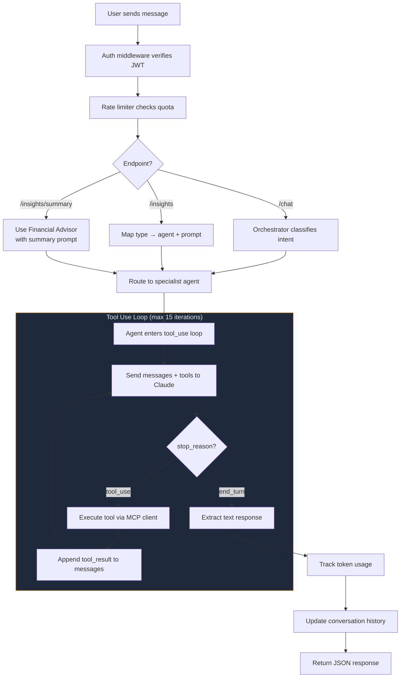

# @finsight/agentic-ai

[](https://www.anthropic.com/)
[](https://modelcontextprotocol.io/)
[](https://www.typescriptlang.org/)
[](https://expressjs.com/)
[](https://vitest.dev/)

Agentic AI service with specialized financial agents powered by Claude. Consumes MCP tools from the FinSight MCP server, implements an orchestrator pattern for intent routing, and exposes a REST API for frontend integration.

> See [AGENTIC_AI.md](../AGENTIC_AI.md) in the project root for the high-level architecture overview.

---

## Table of Contents

- [Directory Structure](#directory-structure)
- [Scripts](#scripts)
- [How It Works](#how-it-works)
- [Adding a New Agent](#adding-a-new-agent)
- [Adding a New Insight Type](#adding-a-new-insight-type)
- [Conventions](#conventions)
- [Testing](#testing)

---

## Directory Structure

```
agentic-ai/
├── src/
│   ├── config/
│   │   └── env.ts                 # Zod-validated environment config
│   ├── utils/
│   │   ├── logger.ts              # Pino structured JSON logger
│   │   └── cost-tracker.ts        # Per-user token usage tracking
│   ├── mcp/
│   │   ├── client.ts              # MCP client manager (SSE transport)
│   │   └── tool-adapter.ts        # MCP tools → Claude tool_use format
│   ├── agents/
│   │   ├── base-agent.ts          # Abstract base with tool_use loop
│   │   ├── orchestrator.ts        # Intent classifier + router
│   │   ├── financial-advisor.ts   # Financial health specialist
│   │   ├── anomaly-detector.ts    # Spending anomaly detector
│   │   ├── budget-optimizer.ts    # Budget optimization specialist
│   │   └── forecaster.ts          # Financial forecasting specialist
│   ├── prompts/
│   │   ├── orchestrator.md        # System prompt: routing instructions
│   │   ├── financial-advisor.md   # System prompt: health assessment
│   │   ├── anomaly-detector.md    # System prompt: anomaly detection
│   │   ├── budget-optimizer.md    # System prompt: budget analysis
│   │   └── forecaster.md          # System prompt: projections
│   ├── conversation/
│   │   └── manager.ts             # Per-user conversation state + TTL
│   ├── middleware/
│   │   ├── auth.ts                # JWT Bearer token verification
│   │   └── rate-limit.ts          # Express rate limiting (chat + insights)
│   ├── routes/
│   │   ├── agent.routes.ts        # Chat, insights, summary endpoints
│   │   └── health.routes.ts       # Health check endpoint
│   ├── server.ts                  # Express app factory
│   ├── index.ts                   # Entry point + graceful shutdown
│   └── __tests__/
│       ├── setup.ts               # Test setup
│       ├── agents/
│       │   ├── orchestrator.test.ts
│       │   ├── financial-advisor.test.ts
│       │   ├── anomaly-detector.test.ts
│       │   ├── budget-optimizer.test.ts
│       │   └── forecaster.test.ts
│       ├── mcp/
│       │   └── client.test.ts
│       └── routes/
│           └── agent.routes.test.ts
├── Dockerfile                     # Multi-stage production build
├── tsconfig.json
├── vitest.config.ts
└── package.json
```

---

## Scripts

| Script | Command | Description |
|--------|---------|-------------|
| `dev` | `npm run dev -w agentic-ai` | Start with hot-reload via `tsx watch` |
| `build` | `npx turbo build --filter=@finsight/agentic-ai` | TypeScript compilation to `dist/` |
| `start` | `npm run start -w agentic-ai` | Run compiled output (`dist/index.js`) |
| `test` | `npx turbo test --filter=@finsight/agentic-ai` | Run all 31 tests |
| `test:watch` | `npm run test:watch -w agentic-ai` | Vitest in watch mode |
| `test:coverage` | `npm run test:coverage -w agentic-ai` | Run tests with coverage report |
| `lint` | `npx turbo lint --filter=@finsight/agentic-ai` | Type-check with `tsc --noEmit` |
| `clean` | `npm run clean -w agentic-ai` | Remove `dist/` directory |

---

## How It Works



### Key components

- **`BaseAgent`** — Abstract class implementing the tool_use loop. Subclasses only need to provide `getSystemPrompt()`. The loop calls Claude, checks `stop_reason`, executes tools via MCP if needed, and iterates up to 15 times.
- **`OrchestratorAgent`** — Makes a lightweight classification call to Claude (max 256 tokens) with the orchestrator system prompt. Parses a JSON response `{ agent, reason }` and delegates to the matched specialist. Falls back to `financial-advisor` on parse failure.
- **`McpClientManager`** — Creates per-request MCP clients over SSE transport, injecting the user's JWT for authenticated tool access.
- **`tool-adapter`** — Converts MCP tool schemas to Claude's `tool_use` format and provides `executeToolViaMcp()` for tool invocation.
- **`ConversationManager`** — In-memory per-user conversation store with configurable TTL (default 30 min) and background cleanup.
- **`CostTracker`** — Accumulates input/output token counts per user for monitoring.

---

## Adding a New Agent

1. **Create the agent class** in `src/agents/`:

```typescript
// src/agents/debt-analyzer.ts
import { BaseAgent } from "./base-agent";
import Anthropic from "@anthropic-ai/sdk";

export class DebtAnalyzerAgent extends BaseAgent {
  constructor(anthropic: Anthropic) {
    super(anthropic, "debt-analyzer");
  }

  getSystemPrompt(): string {
    return this.loadPrompt("debt-analyzer.md");
  }
}
```

2. **Create the system prompt** in `src/prompts/debt-analyzer.md`. Describe the agent's role, capabilities, and output format.

3. **Register in the orchestrator** — Add the agent to the `agents` map in `src/agents/orchestrator.ts`:

```typescript
this.agents = new Map<string, BaseAgent>([
  // ... existing agents
  ["debt-analyzer", new DebtAnalyzerAgent(anthropic)],
]);
```

4. **Update the orchestrator system prompt** (`src/prompts/orchestrator.md`) to include the new agent in its routing instructions.

5. **Add to the route handler** — Add the agent to the `agents` record in `src/routes/agent.routes.ts`:

```typescript
const agents: Record<string, InstanceType<typeof FinancialAdvisorAgent>> = {
  // ... existing agents
  "debt-analyzer": new DebtAnalyzerAgent(anthropic),
};
```

6. **Write tests** in `src/__tests__/agents/debt-analyzer.test.ts`.

---

## Adding a New Insight Type

Insight types are one-shot (no conversation context) and map directly to an agent + prompt.

1. **Add the type to `INSIGHT_AGENT_MAP`** in `src/routes/agent.routes.ts`:

```typescript
const INSIGHT_AGENT_MAP: Record<string, string> = {
  // ... existing types
  "debt-analysis": "debt-analyzer",
};
```

2. **Add the prompt to `INSIGHT_PROMPTS`**:

```typescript
const INSIGHT_PROMPTS: Record<string, string> = {
  // ... existing prompts
  "debt-analysis": "Analyze my debts and suggest an optimal payoff strategy.",
};
```

3. The endpoint will automatically accept the new type — no other changes needed.

---

## Conventions

### Architecture

- All agents extend `BaseAgent` which implements the tool_use loop. Agents only override `getSystemPrompt()`.
- System prompts are loaded from markdown files in `src/prompts/` via `BaseAgent.loadPrompt()`.
- MCP tools are converted to Claude's `tool_use` format via `mcpToolsToClaudeTools()` in `tool-adapter.ts`.
- The orchestrator does a classification call first (max 256 tokens), then delegates to the chosen agent with full tool access.
- Each request creates a fresh MCP client with the user's JWT, ensuring tool calls are scoped to the authenticated user's data.

### Response Shape

All responses follow the main API convention:

```typescript
// Success
{ success: true, data: { response, agent, conversationId, usage } }

// Error
{ success: false, error: { code: string, message: string } }
```

### Rate Limiting

| Endpoint | Limit | Window |
|----------|-------|--------|
| `POST /agent/chat` | 20 requests | 1 minute |
| `POST /agent/insights` | 10 requests | 1 minute |
| `GET /agent/insights/summary` | 10 requests | 1 minute |

Rate limiting is keyed by `userId` (from JWT), falling back to IP if unavailable.

### Model Configuration

| Setting | Value |
|---------|-------|
| Model | `claude-sonnet-4-20250514` |
| Max tokens | 4096 |
| Max tool iterations | 15 |
| Conversation TTL | 30 minutes |
| Cleanup interval | 5 minutes |

### Logging

- Uses Pino for structured JSON logging.
- Every incoming request is logged with method and URL.
- Tool executions are logged with tool name and arguments.
- Errors are logged at the appropriate level with context.

---

## Testing

- **31 tests** across 7 test files
- Framework: Vitest
- Location: `src/__tests__/`

### What is mocked

| Dependency | Mock Strategy |
|------------|---------------|
| `@anthropic-ai/sdk` | Module mock — `messages.create` returns controlled responses |
| `@modelcontextprotocol/sdk` | Module mock — `Client`, `SSEClientTransport` stubbed |
| MCP tool calls | `executeToolViaMcp` returns controlled JSON strings |
| File system | System prompt files stubbed for consistent test data |

### Test suites

| Suite | Tests | Covers |
|-------|-------|--------|
| `agents/orchestrator.test.ts` | Routing decision parsing, fallback logic, delegation to specialists |
| `agents/financial-advisor.test.ts` | Tool use loop execution, system prompt loading, response extraction |
| `agents/anomaly-detector.test.ts` | Anomaly detection flow, tool result handling |
| `agents/budget-optimizer.test.ts` | Budget analysis flow, multi-tool iteration |
| `agents/forecaster.test.ts` | Forecasting flow, token tracking |
| `mcp/client.test.ts` | Client creation, SSE transport config, tool listing, error handling |
| `routes/agent.routes.test.ts` | Request validation, auth enforcement, rate limiting, error responses |

### Running tests

```bash
# All tests
npx turbo test --filter=@finsight/agentic-ai

# Watch mode
npm run test:watch -w agentic-ai

# With coverage
npm run test:coverage -w agentic-ai
```

No external services are required to run tests. All external dependencies (Anthropic API, MCP server, MongoDB) are fully mocked.
