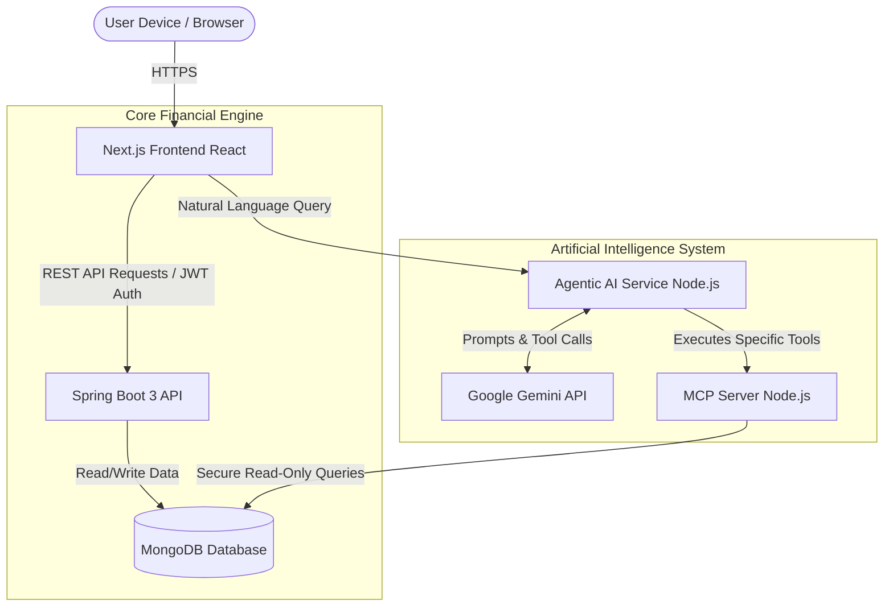

# FinSight: Comprehensive Technical and Business Report

## Table of Contents
1. **Executive Summary**
2. **Problem Statement & Market Context**
3. **Project Vision & Value Proposition**
4. **Core Product Features & User Workflows**
5. **System Architecture Overview**
6. **Backend Architecture Deep Dive (Java & Spring Boot)**
7. **Database Architecture (MongoDB)**
8. **Frontend Architecture Deep Dive (Next.js & React)**
9. **Agentic AI & Model Context Protocol (MCP) Integration**
10. **Security & Authentication Strategy**
11. **Deployment & Development Workflow**
12. **Future Roadmap & Scaling Strategy**
13. **Conclusion**

---

## 1. Executive Summary

FinSight is a next-generation, full-stack personal finance management application designed to bridge the gap between simple digital ledgers and complex enterprise accounting software. At its core, FinSight serves as a centralized dashboard that provides users with clear, actionable visibility into their finances. It empowers individuals to track spending across various accounts, adhere to dynamic budgets, and monitor progress toward long-term financial goals.

What sets FinSight apart from traditional finance trackers is the integration of "Agentic AI"—an autonomous, conversational financial assistant powered by the Google Gemini Large Language Model (LLM) and the open Model Context Protocol (MCP). This AI acts as a personalized financial advisor, capable of answering natural language queries by securely fetching real-time data from the user's database.

Built on a robust technology stack featuring Java 21, Spring Boot 3, MongoDB, and Next.js 14, FinSight is architected for high performance, uncompromising security, and seamless scalability. This report details the "Why," "What," and "How" of the FinSight platform, offering a deep dive into its architecture, design decisions, and future roadmap.

---

## 2. Problem Statement & Market Context

Managing personal finances is a universal challenge. The modern consumer often holds multiple bank accounts, credit cards, and investment portfolios, leading to a fragmented view of their financial health. 

### The Core Challenges:
*   **Data Fragmentation:** Users must log into multiple banking apps to understand their total cash flow.
*   **Reactive vs. Proactive Management:** Most individuals review their bank statements at the end of the month, making it difficult to adjust spending behaviors in real-time.
*   **Complexity of Existing Solutions:** Traditional spreadsheet methods are manual, time-consuming, and highly prone to error. Conversely, enterprise-grade accounting software is overwhelmingly complex for the average consumer.
*   **Lack of Personalized Insight:** While many apps provide pie charts of past spending, they fail to offer personalized, forward-looking advice tailored to the user's specific financial situation.

The market requires a solution that is as easy to use as a basic spreadsheet but as powerful and insightful as a human financial advisor.

---

## 3. Project Vision & Value Proposition

**The Vision:** To democratize financial intelligence by providing an accessible, secure, and highly intelligent platform that simplifies wealth management. 

**The Name:** "FinSight" is a portmanteau of "Financial Sight." The name reflects the platform's core mission: illuminating the user's financial landscape so they can make informed, data-driven decisions.

### Key Value Propositions:
1.  **Centralization:** A single pane of glass for all income, expenses, budgets, and goals.
2.  **Automation & Intelligence:** Reducing manual data entry and leveraging AI to uncover insights that a human might miss.
3.  **Real-time Course Correction:** Dynamic budgeting tools that alert users *before* they overspend, rather than after.
4.  **Security & Privacy:** Ensuring absolute isolation of user data through strict authentication and secure data retrieval protocols.

---

## 4. Core Product Features & User Workflows

FinSight is broken down into several core modules, each designed to tackle a specific aspect of personal finance.

### A. Dashboard & Analytics
The landing page of the application provides an immediate, high-level summary. Users are greeted with total balances, recent transactions, and visual representations of cash flow (income vs. expenses) over the current month. The dashboard utilizes dynamic charts to make digesting complex numbers intuitive.

### B. Transaction Management
This is the foundational ledger of the application.
*   **Logging:** Users can manually log transactions, specifying amount, date, merchant, and category.
*   **Categorization:** Transactions are assigned to specific categories (e.g., Groceries, Utilities, Entertainment). This categorization feeds directly into the budgeting and AI analytics engines.
*   **Search & Filtering:** Advanced filtering allows users to find specific transactions by date ranges, amounts, or tags instantly.

### C. Dynamic Budgeting
Budgets in FinSight are not static numbers; they are active tracking mechanisms.
*   **Category-Specific Limits:** Users can allocate specific funds to different categories.
*   **Real-time Tracking:** As transactions are logged, the budget progress bars update immediately, showing the percentage of the budget utilized and the remaining balance.

### D. Goal Tracking
FinSight encourages long-term financial planning through its Goals module.
*   **Defining Objectives:** Users can create goals such as "Emergency Fund," "Vacation," or "Debt Payoff."
*   **Target Dates:** By setting a target amount and a deadline, FinSight calculates the required monthly contribution to stay on track.

### E. Agentic AI Financial Assistant
The crown jewel of the platform is the chat interface. Users can converse with their financial data in natural language. For example, a user can ask, "How much have I spent on dining out this week compared to last week?" and the AI will fetch the exact numbers and provide a conversational analysis.

---

## 5. System Architecture Overview

FinSight is built using a modern, scalable, and modular **Turborepo monorepo** architecture. This structure allows for efficient project management, unified build pipelines, and seamless code sharing (such as TypeScript interfaces) across the frontend, AI services, and MCP server.

### High-Level Architecture Diagram

The system is logically divided into the Core Financial Engine (handling strict business logic and data persistence) and the AI System (handling natural language processing and autonomous tool execution).

---

## 6. Backend Architecture Deep Dive (Java & Spring Boot)

The core backend of FinSight is built using **Java 21** and the **Spring Boot 3** framework. 

### Why Java and Spring Boot?
Personal finance applications require absolute data integrity, precise arithmetic, and enterprise-grade reliability. Java's strong static typing, mature ecosystem, and Spring Boot's robust dependency injection and security frameworks make it the ideal choice for handling financial ledgers.

### Architectural Patterns
*   **Controller-Service-Repository Pattern:** The application strictly adheres to this layered architecture.
    *   **Controllers:** Handle incoming HTTP requests, validate basic payloads using annotations, and return standardized JSON responses.
    *   **Services:** Contain the complex business logic (e.g., verifying if a transaction exceeds a budget limit, or calculating goal progress).
    *   **Repositories:** Interface with the MongoDB database using Spring Data MongoDB.
*   **Global Exception Handling:** Custom exception handlers intercept errors (like `ResourceNotFoundException` or `ValidationException`) and map them to consistent, user-friendly JSON error responses with appropriate HTTP status codes.
*   **Data Transfer Objects (DTOs):** DTOs are used extensively to decouple the internal database models from the API contracts exposed to the frontend.

---

## 7. Database Architecture (MongoDB)

FinSight utilizes **MongoDB**, a highly scalable NoSQL document database. 

### Why MongoDB?
Financial records often have varying metadata. A transaction might simply be a transfer, or it might include a merchant location, custom user tags, or a linkage to a recurring subscription. MongoDB's BSON (document-based) storage is flexible enough to handle these varying data shapes without requiring the complex, sparse tables and rigid migrations associated with relational databases (SQL).

### Core Collections and Data Modeling
1.  **Users:** Stores authentication credentials, profile information, and overarching settings.
2.  **Categories:** Stores both system-default categories and user-defined custom categories.
3.  **Transactions:** The largest collection. Each document contains an amount, timestamp, type (income/expense), a reference to a `Category` ID, and a mandatory reference to the `User` ID.
4.  **Budgets:** Stores the spending limits per category for a given timeframe (usually monthly).
5.  **Goals:** Stores target amounts, current saved amounts, and deadline timestamps.

### Schema Enforcement and Security
While MongoDB is inherently schema-less at the database level, the schema is strictly enforced at the application layer using Java POJOs (Plain Old Java Objects) in the Spring API and Mongoose schemas in the MCP server. 
**Crucial Security Rule:** Every single query executed against the database across all services is strictly filtered by the authenticated user's ID (`userId`). This multi-tenant architecture ensures complete data isolation.

---

## 8. Frontend Architecture Deep Dive (Next.js & React)

The frontend is engineered to be blazing fast, highly responsive, and visually premium.

### Next.js 14 and the App Router
FinSight utilizes Next.js 14, leveraging the modern App Router. 
*   **Server-Side Rendering (SSR):** Next.js pre-renders pages on the server, resulting in incredibly fast initial load times and superior SEO (though SEO is less critical for a private dashboard, the performance gains are vital).
*   **Routing:** File-system based routing handles complex layouts, such as persistent sidebars and authenticated dashboard views.

### UI and Styling
*   **Tailwind CSS:** A utility-first CSS framework that allows developers to style components rapidly directly within the JSX markup. It eliminates the need for sprawling, unmaintainable CSS files.
*   **shadcn/ui:** To achieve a premium, cohesive look without reinventing the wheel, FinSight relies on shadcn/ui. This provides accessible, customizable components (modals, data tables, dropdowns) built on top of Radix UI primitives.

### State Management and Data Fetching
*   **TanStack Query (React Query):** Traditional React `useEffect` data fetching is error-prone and complex to optimize. FinSight uses TanStack Query to manage server state. It handles fetching data from the Spring Boot API, caching it efficiently in the browser, background refetching, and synchronizing the UI with the server.

---

## 9. Agentic AI & Model Context Protocol (MCP) Integration

The defining feature of FinSight is its AI chatbot, which acts as an autonomous financial agent. This is achieved through a combination of the Google Gemini API, a specialized Node.js service, and the Model Context Protocol.

### The Model Context Protocol (MCP)
MCP is an open standard designed to solve a critical AI problem: how do you let an LLM safely interact with private, local data?
*   **The FinSight MCP Server:** FinSight runs a dedicated, standalone MCP server (`finsight-mcp`). This server acts as a highly secure, restricted boundary.
*   **MCP Tools:** The server exposes specific functions to the AI, known as "tools." Examples include `list_transactions`, `get_category_summary`, and `check_budget_status`.
*   **Security:** The AI cannot write raw SQL or MongoDB queries. It can only request the execution of predefined tools. Furthermore, the MCP server enforces the `userId` filter on every execution, guaranteeing that the AI can only ever access the data of the user currently logged in.

### The Agentic Tool-Calling Loop
The process of generating a personalized insight works via an "Agentic" loop orchestrated by the `finsight-agentic` Node.js service:
1.  **User Prompt:** The user asks, *"Am I spending too much on food this month?"*
2.  **Initial LLM Request:** The Node.js service sends this prompt to the **Google Gemini API**, along with a description of the available MCP tools.
3.  **The "Halt and Tool Call":** Gemini analyzes the prompt and realizes it cannot answer without real data. It halts text generation and returns a structured request asking to use the `get_budget_status` tool for the "Food" category.
4.  **Execution:** The Node.js service intercepts this request, securely calls the MCP server, and retrieves the raw JSON data from MongoDB.
5.  **Context Injection:** The Node.js service sends the raw data back to Gemini as the result of the tool call.
6.  **Final Synthesis:** Armed with exact numbers, Gemini resumes generation, analyzing the data against financial best practices, and returns a conversational, personalized response to the user.

This proactive data-fetching behavior is what makes the AI "Agentic."

---

## 10. Security & Authentication Strategy

Given the sensitive nature of financial data, security is paramount in FinSight.

### Authentication
*   **JSON Web Tokens (JWT):** The system uses stateless JWT authentication. When a user logs in, the Spring Boot API verifies their credentials and issues a cryptographically signed JWT.
*   **Token Lifecycle:** The frontend stores this token securely and attaches it as a `Bearer` token in the `Authorization` header of every subsequent API request. Short-lived access tokens combined with refresh tokens are used to balance security with user convenience.

### Data Security
*   **Transport Layer Security (TLS/SSL):** All communication between the frontend, the API, the AI services, and the database occurs over encrypted HTTPS/TLS channels.
*   **Password Hashing:** Passwords are never stored in plaintext. They are hashed using strong algorithms (like BCrypt) with unique salts before being saved to MongoDB.

---

## 11. Deployment & Development Workflow

FinSight leverages modern DevOps practices to ensure smooth development and deployment.

### The Turborepo Advantage
Because FinSight is a monorepo, Turborepo is used to manage the build pipeline. Turborepo understands the dependencies between packages (e.g., the Next.js app depends on the shared TypeScript types). It caches build outputs locally and in the cloud, drastically reducing build times for developers and CI/CD pipelines.

### Containerization
The entire stack (Spring Boot API, Node.js AI Service, Node.js MCP Server, and MongoDB) is containerized using Docker. This ensures that the application runs identically on a developer's local machine, in staging, and in production environments. Docker Compose is used for local orchestration.

---

## 12. Future Roadmap & Scaling Strategy

While the current iteration of FinSight provides a robust foundation, the architecture is designed to accommodate significant future expansion.

### Phase 2: Open Banking Integration
The next major milestone is moving away from manual transaction entry. FinSight plans to integrate with Open Banking APIs (such as Plaid) to automatically sync transactions from thousands of global banking institutions in real-time.

### Phase 3: Advanced AI Analytics
The Agentic AI capabilities will be expanded to offer predictive modeling. By analyzing historical spending patterns, the AI will be able to forecast cash flow shortages before they happen and proactively suggest adjustments to budgets.

### Scaling Strategy
As the user base grows, the architecture is primed for horizontal scaling:
*   The **Spring Boot API** and **Node.js Services** are entirely stateless (thanks to JWTs), meaning multiple instances can be spun up behind a load balancer to handle increased traffic.
*   **MongoDB** can be scaled horizontally through sharding, distributing the data load across multiple database clusters.

---

## 13. Conclusion

FinSight represents the future of personal finance management. By combining the rock-solid reliability of a Java Spring Boot backend with the lightning-fast user experience of Next.js, it provides a best-in-class foundation for financial tracking. 

However, its true differentiator is the integration of the Google Gemini API and the Model Context Protocol. By transforming the application from a passive ledger into an active, autonomous financial advisor, FinSight doesn't just show users their numbers—it helps them understand what those numbers mean and how to act upon them. The architecture is secure, scalable, and perfectly positioned for future innovations in the Fintech space.
