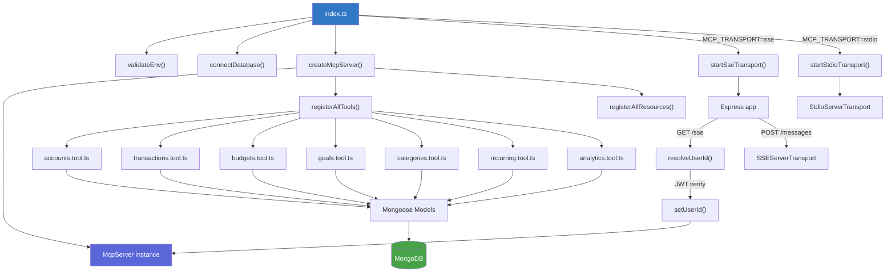

# @finsight/mcp

[](https://modelcontextprotocol.io/)
[](https://www.typescriptlang.org/)
[](https://vitest.dev/)
[](https://nodejs.org/)

MCP server exposing FinSight financial data to AI agents. Implements 35 tools and 4 resources over SSE and stdio transports with JWT-scoped authentication.

---

## Table of Contents

- [Directory Structure](#directory-structure)
- [Scripts](#scripts)
- [Architecture](#architecture)
- [Adding a New Tool](#adding-a-new-tool)
- [Adding a New Resource](#adding-a-new-resource)
- [Conventions](#conventions)
- [Testing](#testing)

---

## Directory Structure

```
mcp/
├── src/
│   ├── config/
│   │   └── env.ts                    # Zod-validated environment config
│   ├── utils/
│   │   ├── logger.ts                 # Pino structured JSON logger
│   │   └── errors.ts                 # McpToolError class
│   ├── db/
│   │   └── connection.ts             # MongoDB connection manager
│   ├── auth/
│   │   └── token-resolver.ts         # JWT verification + userId extraction
│   ├── models/                       # 7 Mongoose models (mirrors apps/api)
│   │   ├── user.model.ts
│   │   ├── account.model.ts
│   │   ├── transaction.model.ts
│   │   ├── category.model.ts
│   │   ├── budget.model.ts
│   │   ├── goal.model.ts
│   │   └── recurring-rule.model.ts
│   ├── tools/                        # 35 MCP tools across 7 modules
│   │   ├── accounts.tool.ts          # 6 tools
│   │   ├── transactions.tool.ts      # 6 tools
│   │   ├── budgets.tool.ts           # 4 tools
│   │   ├── goals.tool.ts             # 5 tools
│   │   ├── categories.tool.ts        # 2 tools
│   │   ├── recurring.tool.ts         # 5 tools
│   │   ├── analytics.tool.ts         # 7 tools
│   │   └── index.ts                  # registerAllTools aggregator
│   ├── resources/                    # 4 MCP resources
│   │   ├── financial-summary.ts      # finsight://summary
│   │   ├── budget-status.ts          # finsight://budget-status
│   │   ├── goal-progress.ts          # finsight://goal-progress
│   │   ├── upcoming-bills.ts         # finsight://upcoming-bills
│   │   └── index.ts                  # registerAllResources aggregator
│   ├── transport/
│   │   ├── sse.ts                    # Express + SSE transport
│   │   └── stdio.ts                  # stdio transport
│   ├── server.ts                     # McpServer factory + ServerContext
│   ├── index.ts                      # Entry point
│   └── __tests__/                    # 62 tests
│       ├── setup.ts
│       ├── auth/
│       └── tools/
├── build.mjs                         # esbuild build script
├── Dockerfile                        # Multi-stage production image
├── tsconfig.json                     # TypeScript config (strict, CommonJS)
├── vitest.config.ts                  # 30s timeout, node environment
└── package.json
```

---

## Scripts

| Script | Command | Description |
|--------|---------|-------------|
| `dev` | `npm run dev -w mcp` | Start with hot-reload via `tsx watch` |
| `build` | `npx turbo build --filter=@finsight/mcp` | Build with esbuild to `dist/` |
| `start` | `npm run start -w mcp` | Run the production build |
| `test` | `npx turbo test --filter=@finsight/mcp` | Run all 62 tests |
| `test:watch` | `npm run test:watch -w mcp` | Run tests in watch mode |
| `test:coverage` | `npm run test:coverage -w mcp` | Run tests with coverage report |
| `lint` | `npm run lint -w mcp` | Type-check with `tsc --noEmit` |
| `clean` | `npm run clean -w mcp` | Remove `dist/` directory |

---

## Architecture



### Key types

```typescript
// server.ts — The context shared across all tools and resources
interface ServerContext {
  server: McpServer;
  getUserId: () => string;   // Throws if no user is authenticated
  setUserId: (id: string) => void;
}
```

Every tool and resource registration function receives `(server: McpServer, getUserId: () => string)`. Calling `getUserId()` in a tool handler returns the authenticated user's ID or throws if authentication has not been established.

---

## Adding a New Tool

**1. Create or edit the tool module**

If the tool belongs to an existing domain (e.g., accounts), add it to the corresponding file. Otherwise, create a new file at `src/tools/<domain>.tool.ts`.

```typescript
// src/tools/example.tool.ts
import { McpServer } from "@modelcontextprotocol/sdk/server/mcp.js";
import { z } from "zod";
import { McpToolError } from "../utils/errors";

function textResult(data: unknown) {
  return { content: [{ type: "text" as const, text: JSON.stringify(data) }] };
}

export function registerExampleTools(
  server: McpServer,
  getUserId: () => string,
) {
  server.tool(
    "my_new_tool",                              // snake_case name
    "Imperative description of what this does", // description
    { someParam: z.string().describe("...") },  // Zod input schema
    async ({ someParam }) => {
      const userId = getUserId();
      // ... query MongoDB, return result
      return textResult({ result: "ok" });
    },
  );
}
```

**2. Register in `src/tools/index.ts`**

```typescript
import { registerExampleTools } from "./example.tool";

export function registerAllTools(server: McpServer, getUserId: () => string) {
  // ... existing registrations
  registerExampleTools(server, getUserId);
}
```

**3. Write tests in `src/__tests__/tools/<domain>.tool.test.ts`**

Create documents directly via Mongoose models, then call the tool handler. Assert on the returned JSON content.

---

## Adding a New Resource

**1. Create the resource file**

```typescript
// src/resources/my-resource.ts
import { McpServer } from "@modelcontextprotocol/sdk/server/mcp.js";

export function registerMyResource(
  server: McpServer,
  getUserId: () => string,
) {
  server.resource(
    "my-resource",                                      // name
    "finsight://my-resource",                         // URI
    "Human-readable description of the aggregated data", // description
    async (uri) => {
      const userId = getUserId();
      // ... aggregate data from one or more models
      return {
        contents: [
          {
            uri: uri.href,
            text: JSON.stringify({ /* aggregated data */ }),
            mimeType: "application/json",
          },
        ],
      };
    },
  );
}
```

**2. Register in `src/resources/index.ts`**

```typescript
import { registerMyResource } from "./my-resource";

export function registerAllResources(server: McpServer, getUserId: () => string) {
  // ... existing registrations
  registerMyResource(server, getUserId);
}
```

---

## Conventions

### Tool output format

All tools return the standard MCP text content structure:

```typescript
{
  content: [{ type: "text", text: JSON.stringify(data) }]
}
```

Use the `textResult()` helper present in each tool module.

### User scoping

Every database query **must** filter by `getUserId()`. There is no admin or cross-user access pattern. Calling `getUserId()` before authentication is established throws an error.

### Error handling

Use `McpToolError` static factories for domain errors:

| Factory | When to use |
|---------|-------------|
| `McpToolError.notFound(msg)` | Document not found or does not belong to user |
| `McpToolError.badRequest(msg)` | Invalid input that passed Zod validation |
| `McpToolError.unauthorized(msg)` | Authentication failure |
| `McpToolError.internal(msg)` | Unexpected server error |

These map to MCP SDK error codes (`InvalidParams`, `InvalidRequest`, `InternalError`).

### Models

Models in `src/models/` mirror `apps/api/src/models/` exactly -- same field names, same collection names, same indexes. If the API model changes, the MCP model must be updated to match.

### Naming

- Tool names: `snake_case` (e.g., `list_accounts`, `spending_by_category`)
- Tool descriptions: imperative sentences (e.g., "List all non-archived accounts")
- Resource URIs: `finsight://<resource-name>`
- Files: `<domain>.tool.ts` for tools, `<domain>.ts` for resources

### Logging

Use the Pino logger from `src/utils/logger.ts`. Log levels are set automatically:
- `test` = `silent`
- `development` = `debug`
- `production` = `info`

---

## Testing

### Setup

Tests use `mongodb-memory-server` with a shared `MongoMemoryServer` instance managed by `src/__tests__/setup.ts`. The setup:

1. Starts a `MongoMemoryServer` before all tests
2. Connects Mongoose to the in-memory instance
3. Clears all collections between tests (`afterEach`)
4. Disconnects and stops the server after all tests

### Running tests

```bash
# All tests
npx turbo test --filter=@finsight/mcp

# Watch mode
npm run test:watch -w mcp

# With coverage
npm run test:coverage -w mcp
```

### Writing tests

Tests live in `src/__tests__/tools/<domain>.tool.test.ts`. The pattern:

1. Create test documents directly via Mongoose models
2. Call the tool registration function to register tools on a test `McpServer`
3. Invoke tool handlers and assert on the returned JSON content

```typescript
import { describe, it, expect, beforeEach } from "vitest";
import mongoose from "mongoose";
import { Account } from "../../models/account.model";

const TEST_USER_ID = new mongoose.Types.ObjectId().toString();

describe("list_accounts", () => {
  beforeEach(async () => {
    await Account.create({
      userId: TEST_USER_ID,
      name: "Checking",
      type: "checking",
      balance: 1000,
      currency: "USD",
    });
  });

  it("should return only the authenticated user's accounts", async () => {
    // ... invoke tool handler, parse JSON from content[0].text, assert
  });
});
```

### Test coverage

| File | Tests |
|------|------:|
| `auth/token-resolver.test.ts` | 7 |
| `tools/accounts.tool.test.ts` | 10 |
| `tools/transactions.tool.test.ts` | 11 |
| `tools/budgets.tool.test.ts` | 8 |
| `tools/goals.tool.test.ts` | 9 |
| `tools/categories.tool.test.ts` | 3 |
| `tools/recurring.tool.test.ts` | 6 |
| `tools/analytics.tool.test.ts` | 8 |
| **Total** | **62** |
